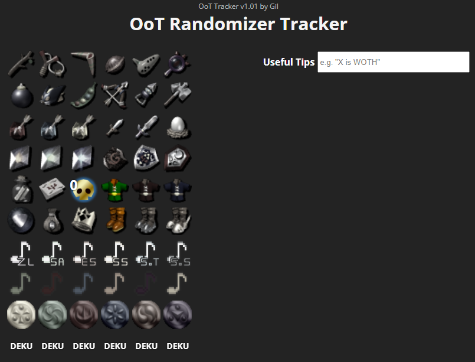

# Simple OOT Rando Tracker

Foobar is a Python library for dealing with word pluralization.

## Installation

Just access this [link](https://fgil90.github.io/OoT-randomizer-tracker/) and use it to your heart's content.

## Usage

* Left-click the items to track them or cycle forward if they are upgradeable or trade items.
* Right-click the items to untrack or cycle backward. 
* Keep track of tips using the input box. If the tips contain "WOTH", "hero" or "fool", they will color-code the tip accordingly.

## Contributing
Pull requests are welcome. For major changes, please open an issue first to discuss what you would like to change.

Please make sure to update tests as appropriate.

## License
[GNU](https://choosealicense.com/licenses/gpl-3.0/)